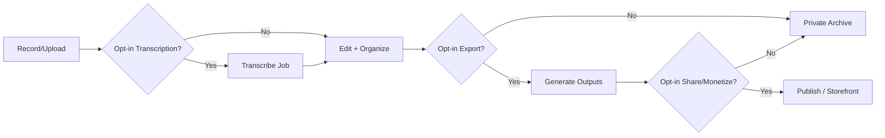

# Architecture (MVP)

## Overview
- **Web**: Next.js (public site + authenticated dashboard)
- **API**: Node/Next API routes or separate service
- **DB**: Postgres
- **Storage**: S3-compatible bucket
- **Transcription**: external provider, invoked only when user opts in
- **Payments**: Stripe Connect or equivalent (later)

## Security
- TLS everywhere
- Private buckets + signed URLs
- Role-based access control
- Audit logging for access + exports

## Assistive AI pipeline (optional)
- suggestion-only; never auto-publish
- user sees diff / can undo
- no training on private stories

